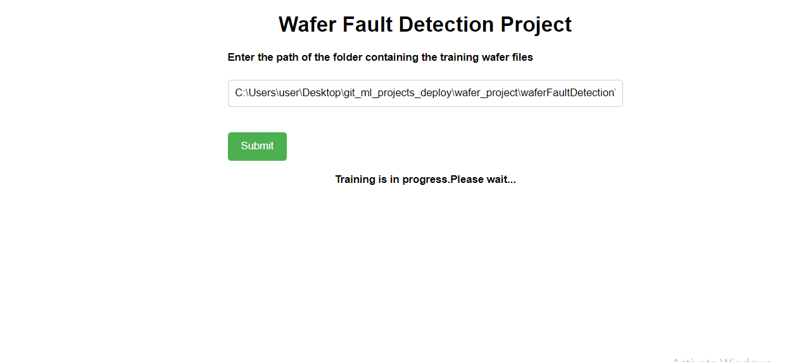
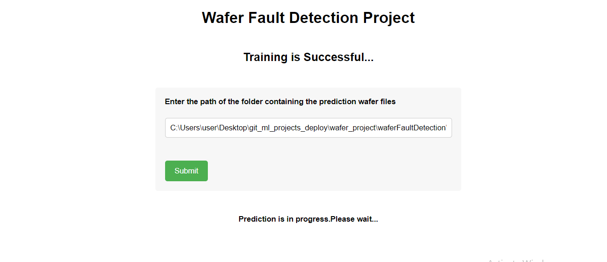
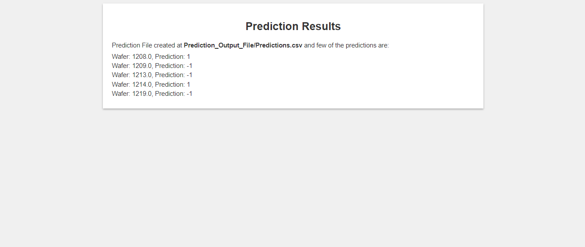

# Wafer Fault Detection
**This is an end to end production ready application built for wafer fault detection with training and prediction pipeline**

**Project Overview**

This project is focused on building a classification model that predicts the quality of electronic wafers based on information gathered by 590 sensors fitted on the production line. The client will send data in multiple sets of files in batches to a given location. Each set of files contains wafer names and 590 columns of different sensor values for each wafer. The last column of each file will have a "Good/Bad" value for each wafer, where "+1" represents a good wafer and "-1" represents a bad wafer.

**Problem Statement**

To build a classification methodology to predict the quality of electronic wafer on the basis of information gathred by 
590 sensors that were fitted on the prouction line. 

**Data Requirements**

Apart from the training files, we require a "schema" file from the client that contains all the relevant information about the training files, including:

- Name of the files
- Length of Date value in FileName
- Length of Time value in FileName
- Number of Columns
- Name of the Columns and their datatype

**User Interface**
**Training Path Page**
The training path page displays a form where user can enter the path of the training batch files.After submitting the form, the training pipeline will start at the moment itself.

**Prediction Path Page**
You will get the message as training pipeline successful if it is completed. Next, you need to enter the path of prediction batch files and submit the form.

**Prediction Page**
In this page, you get some of the predictions that is available in the csv file.

**Tech used:**

- Python
- scikit-learn
- sqlite
- pandas
- numpy
- logger
- kneed ( python library for getting best k value)
- colored (python library for getting color output in terminal)

**Algorihtms used**

- Random Forest Classifier
- XGBoost Classifier

**Accuracy Metric** 

- AUC Score

**Deployment**

This project deployed on AWS EC2 Instance using github actions.You can access it with this url : 
ec2-54-221-144-95.compute-1.amazonaws.com:8080

**Conclusion**

This project aims to provide an accurate classification model for predicting the quality of electronic wafers. By utilizing machine learning techniques and the sensor values, i hope to help the client improve their production line